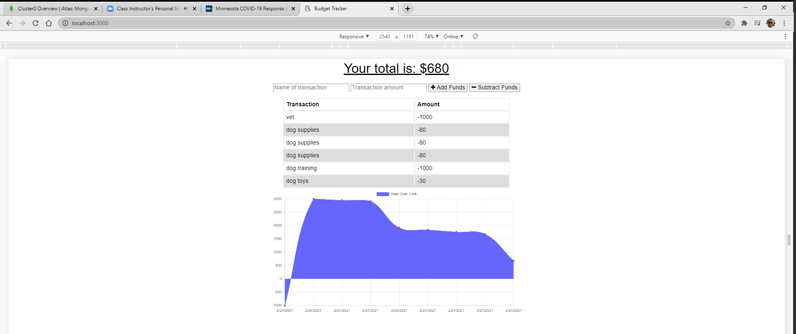
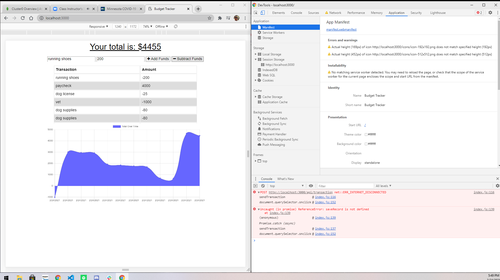

# HW18-BudgetTracker
This is an application that allows users to track their budget offline.  The user is able to input withdrawals and deposits to their budget.  Withdrawals  and deposits can be labeled however the user chooses, and a line graph appears at the bottom of the screen to show the user's spending. The applications functions equally online and offline with offline entries being automatically entered into the tracker.  This application uses node.js, express.js, MongoDB, mongoose, compression.

## Deployed
https://boiling-fortress-40252.herokuapp.com/

# Screenshots 

Below are the screen shots of the application

##

